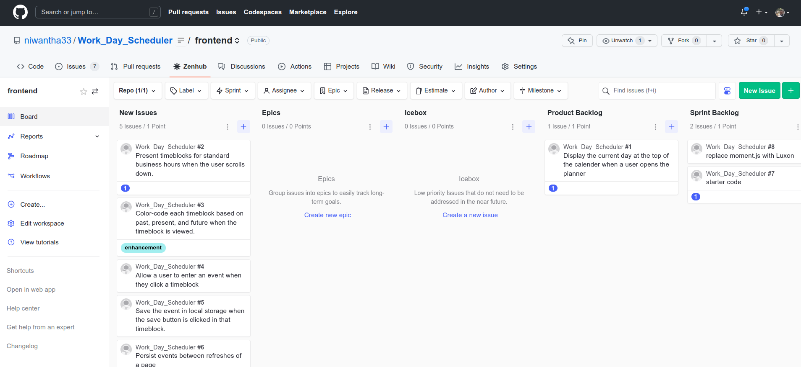

# Work_Day_Scheduler
Link: [https://niwantha33.github.io/Work_Day_Scheduler/](https://niwantha33.github.io/Work_Day_Scheduler/)

The below code is validating the input  (task_.length > 0) and if the current day is a weekday (getWorkDaysHours.dayWeekOrWeekend === 'week'). If both of these conditions are true, it creates an object with the current date, the time, and the task, and then saves this object to local storage using the function retrieveAndSaveToLocalStorage(obj). 


```javascript
    // timeBlock data -  save only weekdays and task_.length >0  
        if (task_.length > 0  && getWorkDaysHours.dayWeekOrWeekend === 'week') { // check the input val

            let time_label = $(`#label-${this.id}`).text().trim();

            let obj = {
                day: luxon.DateTime.now().toLocaleString(), // 1/29/2023
                time: time_label,
                task: task_
            }

            retrieveAndSaveToLocalStorage(obj)
        }
```
To create rows of elements (label, textarea and button) to the container div element (class 'container'),
each row represents a timeBlock.Then it loops through an array called 'time_', which contains the standard times 

```javascript

 // creates elements to div row 
            let row = $("<div/>", {
                class: "row no-gutters",
                id: "row_animate"
            }).appendTo(container);

            $("<label/>", {
                class: "hour",
                for: "hour",
                id: `label-${i}`,
                text: `${time_[i]}`

            }).appendTo(row);

            $("<textarea/>", {
                class: `${time_label} description`,
                id: `${i}`,
                name: `${i}`

            }).appendTo(row);

            $("<button/>", {
                class: `saveBtn ${i}`,
                id: `${i}`,
                html: `<i class="bi bi-save"></i>`

            }).appendTo(row);
```

It removes any children. 

```javascript

        let container = $('.container'); // get the div element 

        // delete all the children 
        if (container.children().length > 0) {

            container.empty();

        }
```
Changing color-code
-   If the current index is less than 'idx', the class is set to 'past' (color_code[0]). If the current index is equal to 'idx', the class is set to 'present' (color_code[1]). And if the current index is greater than 'idx', the class is set to 'future' (color_code[2])

```javascript
            if (time_.includes(getWorkDaysHours.hour_12hrs_format)) {

                idx = time_.indexOf(getWorkDaysHours.hour_12hrs_format);
            }

            // set the color of the rows 
            if (i < idx) {
                time_label = color_code[0];

            } else if (i == idx) {
                time_label = color_code[1];

            } else if (i > idx) {
                time_label = color_code[2];
            }

```

## Project Management Tool - ZenHub 




## Credits

[Luxon Examples](https://moment.github.io/luxon/demo/global.html)

[Luxon Table of tokens](https://moment.github.io/luxon/#/formatting)