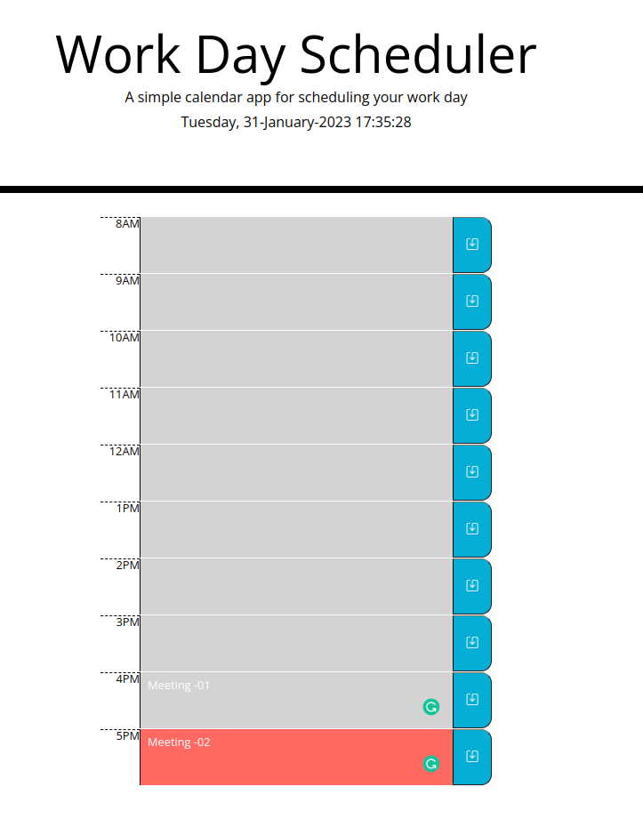

# Work_Day_Scheduler
Link: [https://niwantha33.github.io/Work_Day_Scheduler/](https://niwantha33.github.io/Work_Day_Scheduler)





The below code is validating the input  (task_.length > 0) and if the current day is a weekday (dayWeekOrWeekend === 'week'). If both of these conditions are true, it creates an object with the current date, the time, and the task, and then saves this object to local storage using the function retrieveAndSaveToLocalStorage(obj). 


```javascript
    // timeBlock data -  save only weekdays and task_.length >0  
     let _dayWeekOrWeekend = luxon.DateTime.now().toFormat('EEE');
        // timeBlock data will save only week days and task_ not be null 

        let dayWeekOrWeekend = ['Sat', 'Sun'].includes(_dayWeekOrWeekend[0]) ? 'weekend' : 'week';

        if (task_.length > 0 && dayWeekOrWeekend === 'week') { // check the input val
            // time_label is to get the timeBlock label (time - hour)
            let time_label = $(`#label-${this.id}`).text().trim();

            let obj = {
                day: luxon.DateTime.now().toLocaleString(), // 1/29/2023
                time: time_label,
                task: task_
            }

            // create new p element and display saved 
            retrieveAndSaveToLocalStorage(obj);
            // create new p element and display saved 
            let pEl = displayTimeBlockStoreMsg(`${time_label}-${task_}`);
            // wait 2 sec before remove created p element 
            setTimeout(()=>{
                pEl.remove();

            }, 2000);
        }
```
To create rows of elements (label, textarea and button) to the container div element (class 'container'),
each row represents a timeBlock.Then it loops through an array called 'time_', which contains the standard times 

```javascript

 // creates elements to div row 
            let row = $("<div/>", {
                class: "row no-gutters",
                id: "row_animate"
            }).appendTo(container);

            $("<label/>", {
                class: "hour",
                for: "hour",
                id: `label-${i}`,
                text: `${time_[i]}`

            }).appendTo(row);

            $("<textarea/>", {
                class: `${time_label} description`,
                id: `${i}`,
                name: `${i}`

            }).appendTo(row);

            $("<button/>", {
                class: `saveBtn ${i}`,
                id: `${i}`,
                html: `<i class="bi bi-save"></i>`

            }).appendTo(row);
```

It removes any children. 

```javascript

        let container = $('.container'); // get the div element 

        // delete all the children 
        if (container.children().length > 0) {

            container.empty();

        }
```
Changing color-code
-   If the current index is less than 'idx', the class is set to 'past' (color_code[0]). If the current index is equal to 'idx', the class is set to 'present' (color_code[1]). And if the current index is greater than 'idx', the class is set to 'future' (color_code[2])

```javascript
            if (time_.includes(currentTime)) {

                idx = time_.indexOf(currentTime);
            }

            // set the color of the rows 
            if (i < idx) {
                time_label = color_code[0];

            } else if (i == idx) {
                time_label = color_code[1];

            } else if (i > idx) {
                time_label = color_code[2];
            }

```
createTimeBlocks() function will call every hour and currentDay <p> element text will update  every sec. 

```javascript

            setInterval(
            function () {
                //EEEE	day 
                let cTime = luxon.DateTime.now().toFormat('EEEE, dd-MMMM-yyyy HH:mm:ss ')	//=>	"01-27-2023"

                currentDay.text(cTime); // update the time every sec 

                // // console.log(luxon.DateTime.now().hour, prev_timer)

                // run set_time_blocks() function every hour  
                if (prev_timer !== luxon.DateTime.now().hour) {
                    // console.log(luxon.DateTime.now().minute, prev_timer)
                    createTimeBlocks();
                    // debugger;
                    // update the prev_timer to current hour 
                    prev_timer = luxon.DateTime.now().hour;
                }

            }, 1000);// call every one sec 

```

## Project Management Tool - ZenHub 
To arrange and select the most important  GitHub project issues,  I learned a new tool called  ZenHub project management tool which helped me to visualise and speed up my work.  


## Credits

[Luxon Examples](https://moment.github.io/luxon/demo/global.html)

[Luxon Table of tokens](https://moment.github.io/luxon/#/formatting)